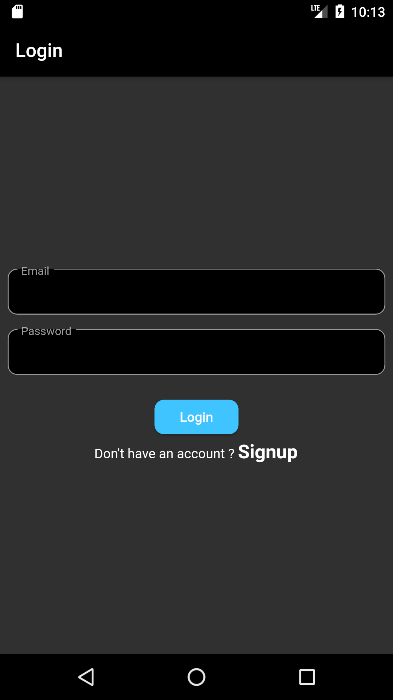
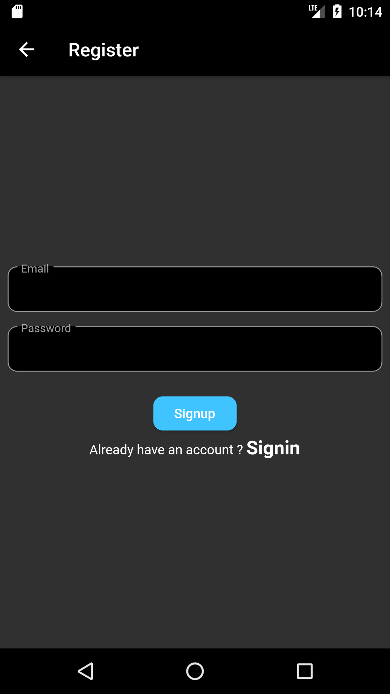
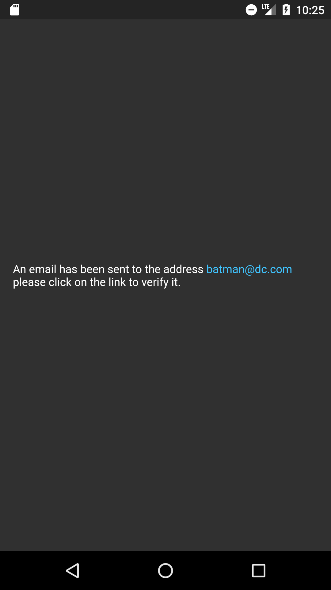
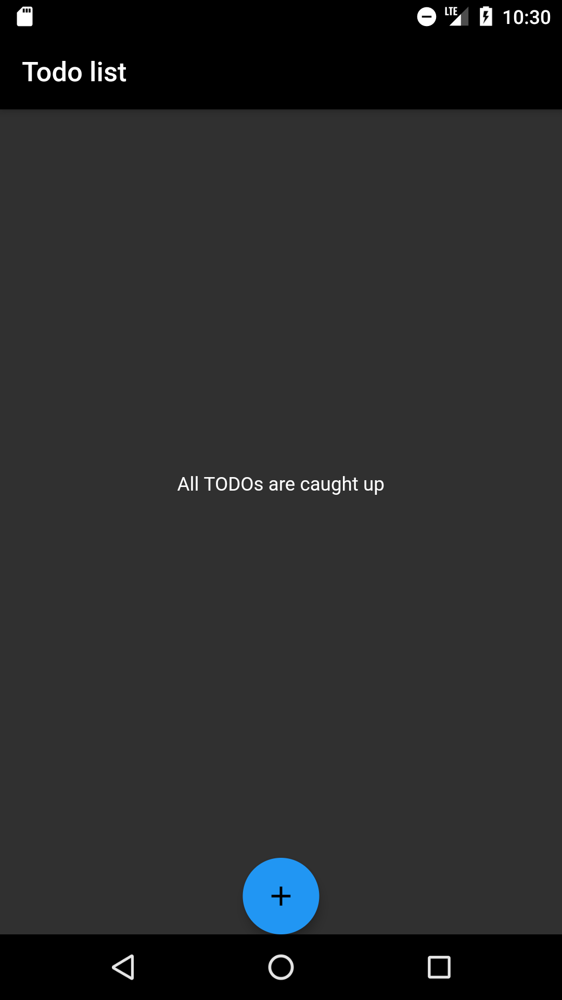
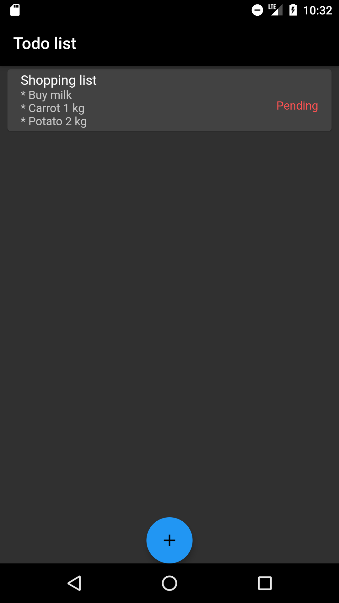
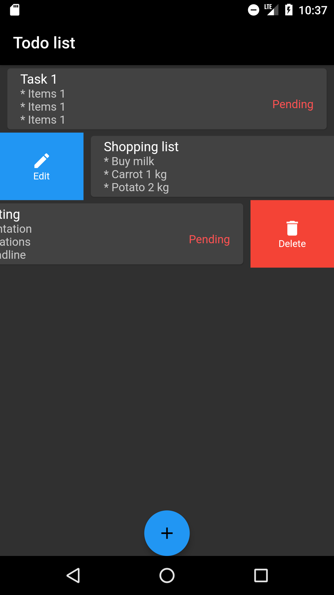
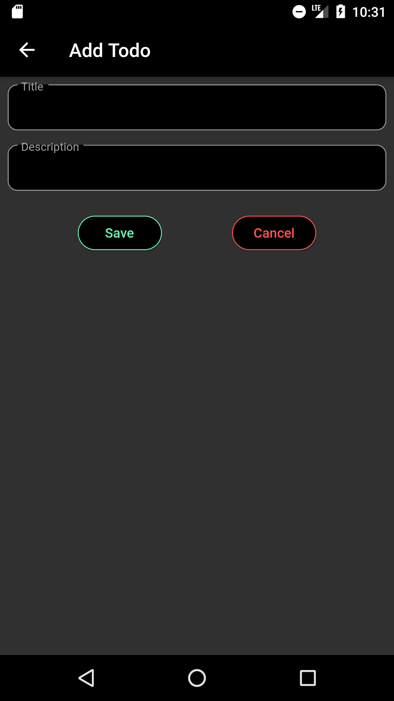
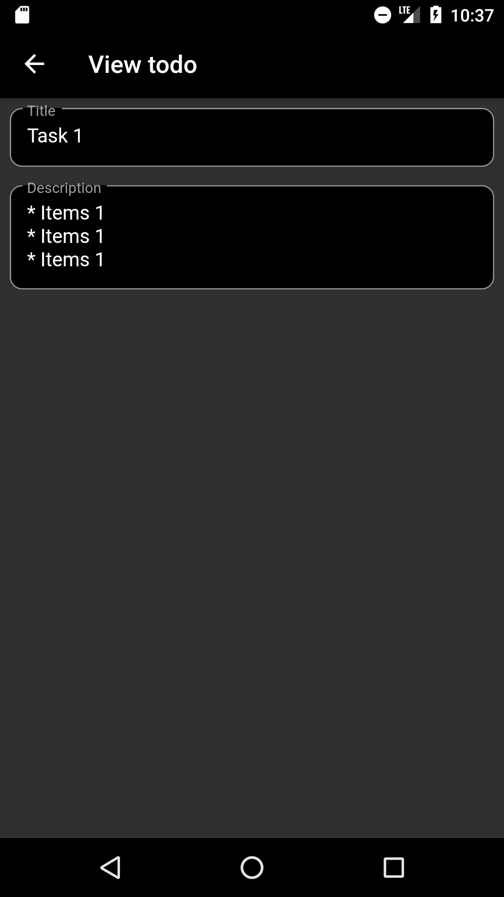
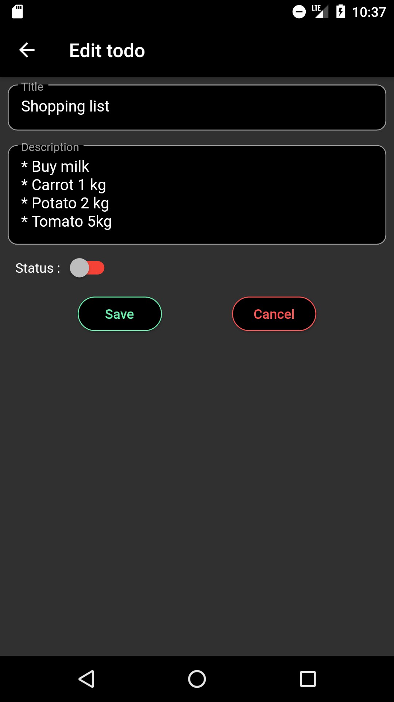
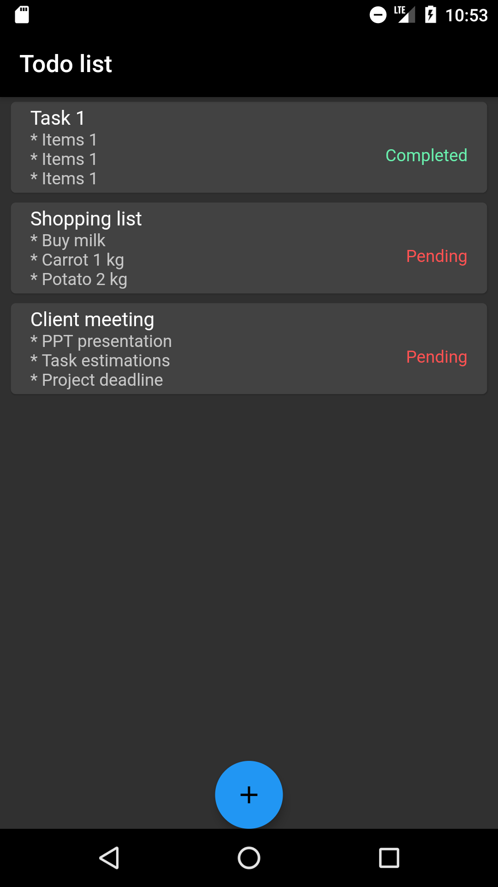

#  Todo application

In progress classic Todo application using flutter with firebase as the backend

### App screens

| Login                   | Register                      | Email verification                                 |
| ----------------------- | ----------------------------- | -------------------------------------------------- |
|  |  |  |

| Empty Todo List                             | Todo List                       | Delete and Edit options                                    |
| ------------------------------------------- | ------------------------------- | ---------------------------------------------------------- |
|  |  |  |

| Add Todo                      | View Todo                       | Edit Todo                       |
| ----------------------------- | ------------------------------- | ------------------------------- |
|  |  |  |

| Todo List Status              |
| ----------------------------- |
|  |